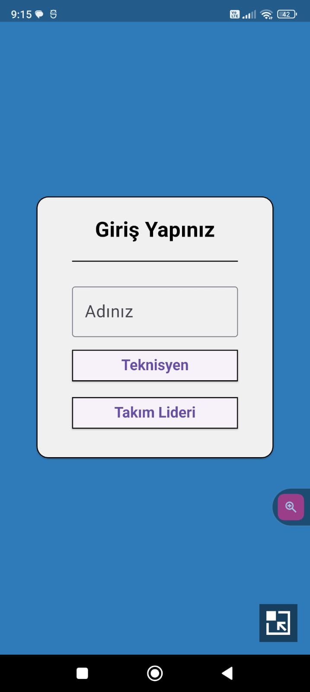
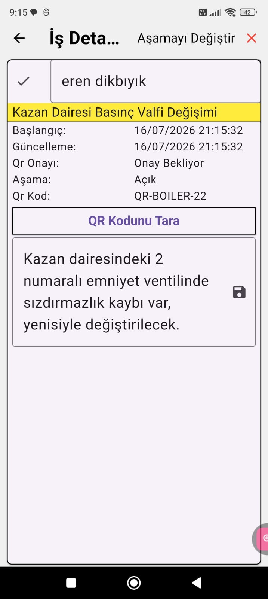
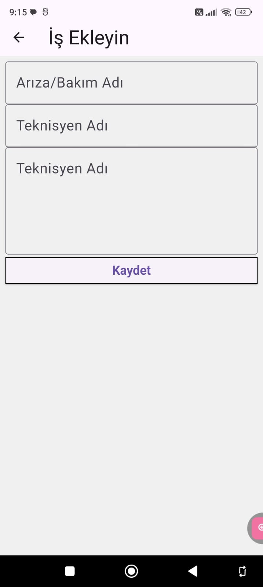
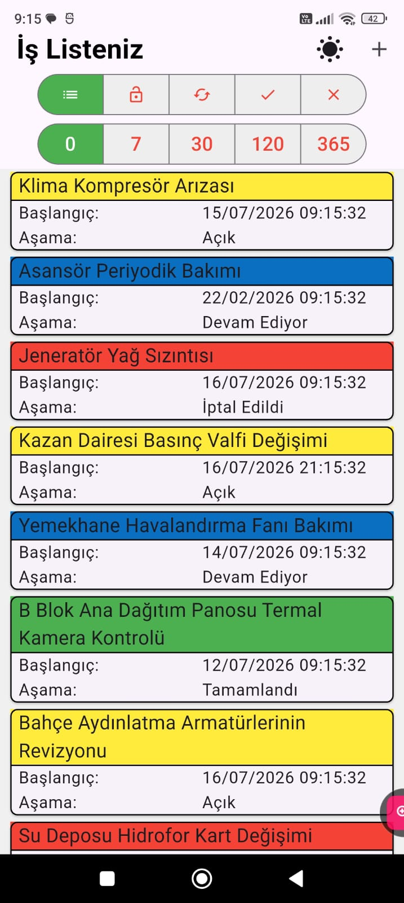

# saha_bakim

A new Flutter project.

🛠️ Saha Bakım

Saha teknisyenlerinin iş emirlerini anlık olarak takip edebilmesi, düzenleyebilmesi ve yeni iş kayıtları oluşturabilmesi için geliştirilmiş Çevrimdışı Öncelikli (Offline-First) bir mobil saha yönetim uygulamasıdır.

🚀 Öne Çıkan Özellikler

    Offline-First Altyapısı: İnternet bağlantısı kopsa dahi tüm iş emirleri yerel cihaz hafızasında güvenle saklanır.

    İş Emri Yönetimi: Yeni iş emri oluşturma, detayları inceleme, durum güncelleme (Açık, Devam Ediyor, Tamamlandı, İptal Edildi).

    QR Kod Doğrulama: Teknisyenin doğru cihazın başında olduğunu doğrulamak için entegre QR kod tarayıcı sistemi.

    Fotoğraflı Kanıt Entegrasyonu: Tamamlanan işlere cihaz kamerasını kullanarak anında fotoğraf ekleme desteği.

    Çift Tema Desteği: Açık (Light) ve Koyu (Dark) tema arasında dinamik geçiş.

🏗️ Teknoloji Yığını

    State Management (Durum Yönetimi): Provider ile performanslı ve reaktif ekran güncellemeleri.

    Local Database (Yerel Hafıza): Hive NoSQL veritabanı ile ultra hızlı yerel depolama.

    Navigation (Yönlendirme): GoRouter ile deklaratif ve güvenli sayfa geçişleri.

    Hardware Integration (Donanım Entegrasyonu):

    image_picker (Kamera kullanımı)

    mobile_scanner (Kamera ile QR/Barkod okuma)

    Kod Üretimi: build_runner ve hive_generator ile otomatik adaptör üretimi.

🛠️ Kurulum ve Çalıştırma

git clone https://github.com/Cutloyut/Saha-Bak-m-App
cd saha_bakim
flutter clean
flutter pub get
dart run build_runner build --delete-conflicting-outputs
flutter run

## 🏗️ Mimari Bilgiler

- Feature-based mimari kullanıldı
- Proje yapısını görmek için:
  `lib/pathinfo.txt`

## ⏸️ index.dart (Barrel File) Nedir?
    Projedeki lib/index.dart dosyası, tüm servisleri, modelleri ve ekranları tek bir çatı altında toplayan bir giriş kapısıdır (Barrel File).

## 📸 Ekran Görüntüleri

### 🫕 Giriş Ekranı

### 🏠 Ana Sayfa

### ➕ İş Ekleme

### ✏️ İş Detayları

